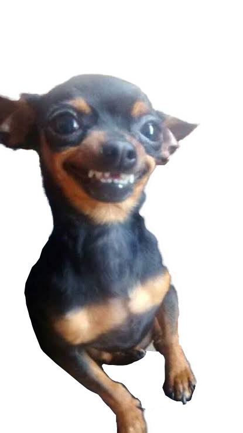
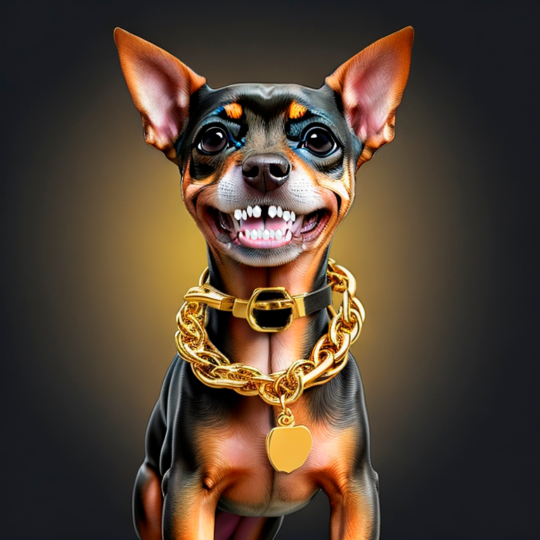

# 🐾 History

Por volta de 2010, na Inglaterra, começou a circular um meme muito engraçado na internet. Era protagonizado por um pinscher adorável chamado Flokinho, conhecido por ser brincalhão e feroz ao mesmo tempo. Ele tinha o hábito de sorrir o tempo todo, e quando ficava bravo, seus dentes ficavam ainda mais engraçados. Flokinho conquistou a todos com seu jeito peculiar de interagir com as pessoas.

Em 2012, Silvano, um grande admirador de Flokinho, pediu para tirar uma foto dele e a publicou nas redes sociais. A imagem rapidamente se tornou viral, acumulando uma grande quantidade de likes e comentários. Pessoas de diferentes partes do mundo começaram a criar imagens engraçadas com base no meme de Flokinho. Ele se tornou um fenômeno não apenas nacional, mas também internacional, amado por todos.

<figure><figcaption></figcaption></figure>

 

<figure><figcaption></figcaption></figure>

No ano de 2015, a família de Flokinho decidiu se mudar para um novo país. Embora a mudança fosse necessária, isso significava deixar para trás as memórias e a popularidade que Flokinho tinha conquistado. Silvano sentia-se triste com a ideia de perder essa conexão com o meme tão querido.

No entanto, Vicente, amigo de Silvano e experiente no criptomercado, teve uma ideia brilhante. Ele decidiu unir suas habilidades e paixões para criar uma memecoin em homenagem a Flokinho, garantindo que ele sempre seria lembrado por todos.

Vicente Santos , desenvolveu a Pinscher Coin, uma criptomoeda baseada na tecnologia blockchain que incorpora elementos divertidos do meme de Flokinho. A Missão de Pinscher Coin é ganhar popularidade entre os fãs do meme e entusiastas de criptomoedas.

<figure><figcaption></figcaption></figure>

Com o lançamento da Pinscher Coin, as pessoas poderiam apoiar a causa de manter viva a memória engraçada de Flokinho e, ao mesmo tempo, se envolver em transações criptográficas. Parte do lucro gerado pela Pinscher Coin será destinado a organizações de proteção animal e ajudar as pessoas em honra ao amor que Flokinho despertava pelas pessoas e animais.

Pinscher Coin se tornará um sucesso estrondoso, garantindo que Flokinho e seu legado fossem preservados para sempre. Silvano irá se sentir muito orgulhoso ao ver como o meme de Flokinho irá ser transformado em algo tão significativo, impactando positivamente a vida das pessoas e dos animais.

A história de Flokinho e da Pinscher Coin servirá como um lembrete de como a internet e a criatividade podem unir as pessoas e fazer a diferença. Um meme que começou como uma simples piada na internet se transformou em um símbolo de alegria, solidariedade e preservação da memória de um pinscher engraçado e amado por todos.
