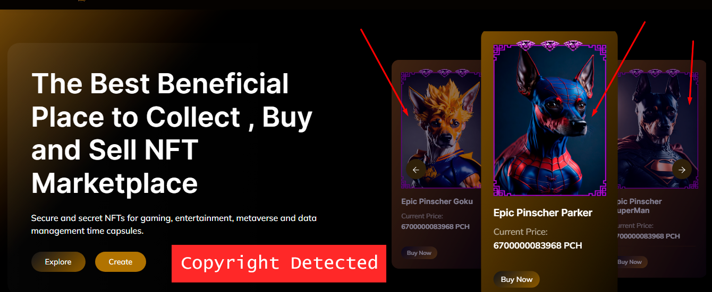

# ⚠ Information

<figure><figcaption></figcaption></figure>

Unfortunately, our project did not pass the CMC and CG analysis, resulting in a loss of 5k USDT. The problem identified was related to copyright. They claimed that the NFTs minted on the network have features of characters that already exist in films and cartoons.

However, we are facing financial difficulties, as our pre-sales were lower than necessary to sustain the project. Because a very large structure was created for little liquidity.

Talking to the team, we realized that everyone is discouraged by this situation. More than 8k USDT was invested to redesign the project, and our pre-sale did not achieve the expected results. This is due to the costs of servers and programmers needed to maintain the project.

We apologize to everyone for the situation. Unfortunately, without an initial list at CMC and this copyright issue, it is difficult to contribute to the project.

As part of our organization, we decided to terminate the contract and keep the platform online until its expiration. The project will soon be closed.

Our liquidity is locked for 2 years and anyone who has funds is free to sell!
