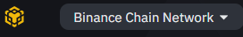

# ✅ Conectando sua carteira

Você fez uma carteira e obteve seus tokens BEP20, agora você só precisa conectar sua carteira ao EvocSwap e pronto!

Confira as etapas abaixo sobre como conectar cada uma de nossas carteiras recomendadas a EvocSwap.

## Smartphone/Celular




Para conectar a Trust Wallet, siga as etapas abaixo. Observe que os dispositivos Android e iOS não usam as mesmas etapas!

### Android

1 . Abra a Trust Wallet e toque no botão DApps na parte inferior da tela.

1 . Digita na barra de pesquisa https://evocswap.com e clica em continuar para abrir a plataforma.

1 . Após clicar na rede BSC Network e em seguida na desce na parte inferior e conecta a carteira.

1 . A EvocSwap será aberto. Se você vir um botão Conectar no canto superior direito, toque nele e toque em Confiar na carteira na lista.


Se você achar que não consegue se conectar na etapa 4, volte ao menu DApps e encontre "EvocSwap" novamente. Usar "Evoc Swap" da seção "Histórico" pode resultar no mesmo problema.


### Recursos

[**Download Trust Wallet**](https://trustwallet.com) (detecta automaticamente o dispositivo)

Guia de [**configuração do Trust Wallet**](https://www.binance.com/en/blog/ecosystem/how-to-set-up-and-use-trust-wallet-for-binance-smart-chain-421499824684901157)****




Para conectar o MetaMask a EvocSwap, siga os passos abaixo.

### Android e iOS

1 . Abra o MetaMask e toque no ícone no canto superior esquerdo.

1 . Toque em Configurações no menu.




### Carteiras de desktop/navegador da Web




### Chrome e Firefox

Abra o MetaMask e clique no seletor de rede na parte superior. Por padrão, ele mostrará "Ethereum Mainnet". Role para baixo e clique em RPC personalizado.

1 . Uma janela se abrirá. Digite os detalhes abaixo.

**Network Name:** Binance Smart Chain                                                                  **New RPC URL:** [https://bsc-dataseed.binance.org](https://bsc-dataseed.binance.org)                                             **Chain ID:** 56                                                                                                   **Currency Symbol (optional):** BNB                                                                       **Block Explorer URL (optional):** [http://bscscan.com](https://bscscan.com)

1 . Verifique se você digitou tudo corretamente e clique em Salvar. A Binance Smart Chain agora será uma de suas opções de rede.

1 . Visite o [site da EvocSwap](https://evocswap.com). No canto inferior, você verá o botão [Connect Wallet](https://evocswap.com). Clique.

.JPG>)

Uma janela aparecerá solicitando que você escolha uma carteira para se conectar. **Clique em MetaMask** (é a primeira opção da lista).

### Recursos

[**Download MetaMask**](https://metamask.io/download.html) (Detecta automaticamente o navegador).                                      Guia de [**configuração do MetaMask**](https://academy.binance.com/en/articles/connecting-metamask-to-binance-smart-chain)\





### Chrome e Firefox

1 . Abra a Binance Chain Wallet e clique no seletor de rede na parte superior. A rede padrão será a Binance Chain. Escolha **Binance Smart Chain** na lista.

1 . Abra a Binance Chain Wallet e clique no seletor de rede na parte superior. A rede padrão será a Binance Chain. Escolha Binance Smart Chain na lista.

1 . Uma janela aparecerá solicitando que você escolha uma carteira para se conectar. Clique em **Binance Chain Wallet** (está mais abaixo na lista).

### Recursos

[**Download Binance Wallet**](https://www.binance.org/en) ( detecta automaticamente o navegador).                          **Guia de configuração da carteira do Binance Wallet**




**Lembre-se - NUNCA, em qualquer situação, você deve dar a alguém sua chave privada ou frases de recuperação.**


