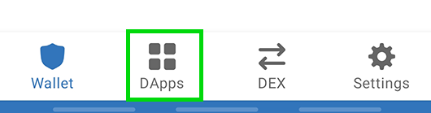

# ✅ CONNECTING YOUR WALLET

You made a wallet and got your BEP20 tokens, now you just need to connect your wallet to EvocSwap and that's it!

Check out the steps below on how to connect each of our recommended wallets to EvocSwap.

## Smartphone / Cellphone




To connect to Trust Wallet, follow the steps below. Please note that Android and iOS devices do not use the same steps!

### Android

1 . Open Trust Wallet and tap the DApps button at the bottom of the screen.

2 . Type https://evocswap.com in the search bar and click continue to open the platform.

3 . After clicking on the BSC Network and then on the drop down at the bottom and connect the wallet.

4 . EvocSwap will open. If you see a Connect button in the top right, click on it and click Trust wallet in the list.


If you find that you can't connect in step 4, go back to the DApps menu and find "EvocSwap" again. Using "Evoc Swap" from the "History" section can result in the same problem.


## **Resources**

****[**Download Trust Wallet** ](https://trustwallet.com)(automatically detects the device)

****[**Trust Wallet Setup Guide**](https://www.binance.com/en/blog/ecosystem/how-to-set-up-and-use-trust-wallet-for-binance-smart-chain-421499824684901157)****




To connect MetaMask to EvocSwap, follow the steps below.

## Android and iOS

1 . Open MetaMask and tap the icon in the upper left corner.

2 . Click on settings on the menu.




## **Desktop/Web Browser Wallets**




## Chrome and Firefox

Open MetaMask and click on the network selector at the top. By default it will show "Ethereum Mainnet". Scroll down and click on Custom RPC.

1 . A window will open. Enter details below.

**Network Name:** Binance Smart Chain                                                                  **New RPC URL:** [https://bsc-dataseed.binance.org](https://bsc-dataseed.binance.org)                                             **Chain ID:** 56                                                                                                   **Currency Symbol (optional):** BNB                                                                       **Block Explorer URL (optional):** [http://bscscan.com](https://bscscan.com)

1.Make sure you typed everything correctly and click Save. Binance Smart Chain will now be one of your network options.

2 . Visit the EvocSwap website. In the bottom corner, you will see the Connect Wallet button. [Click](https://evocswap.com).

.JPG>)

A window will appear asking you to choose a wallet to connect to. Click on MetaMask (it's the first option in the list).

## Recurces

****[**Download MetaMask** ](https://metamask.io/download/)**(Automatically detect browser).**&#x20;

****[**MetaMask Setup Guide**](https://academy.binance.com/en/articles/connecting-metamask-to-binance-smart-chain)\





## Chrome and Firefox

1 . Open Binance Chain Wallet and click on the network selector at the top. The default network will be Binance Chain. Choose Binance Smart Chain from the list.

2 . A window will appear asking you to choose a wallet to connect to. Click on Binance Chain Wallet (it's further down the list).

## **Resources**

****[**Download Binance Wallet** ](https://www.bnbchain.world/en)**(automatically detects browser).**&#x20;

****[**Binance Wallet Wallet Setup Guide**](https://docs.binance.org)****




**Remember - NEVER, under any circumstances, should you give someone your private key or recovery phrases.**


