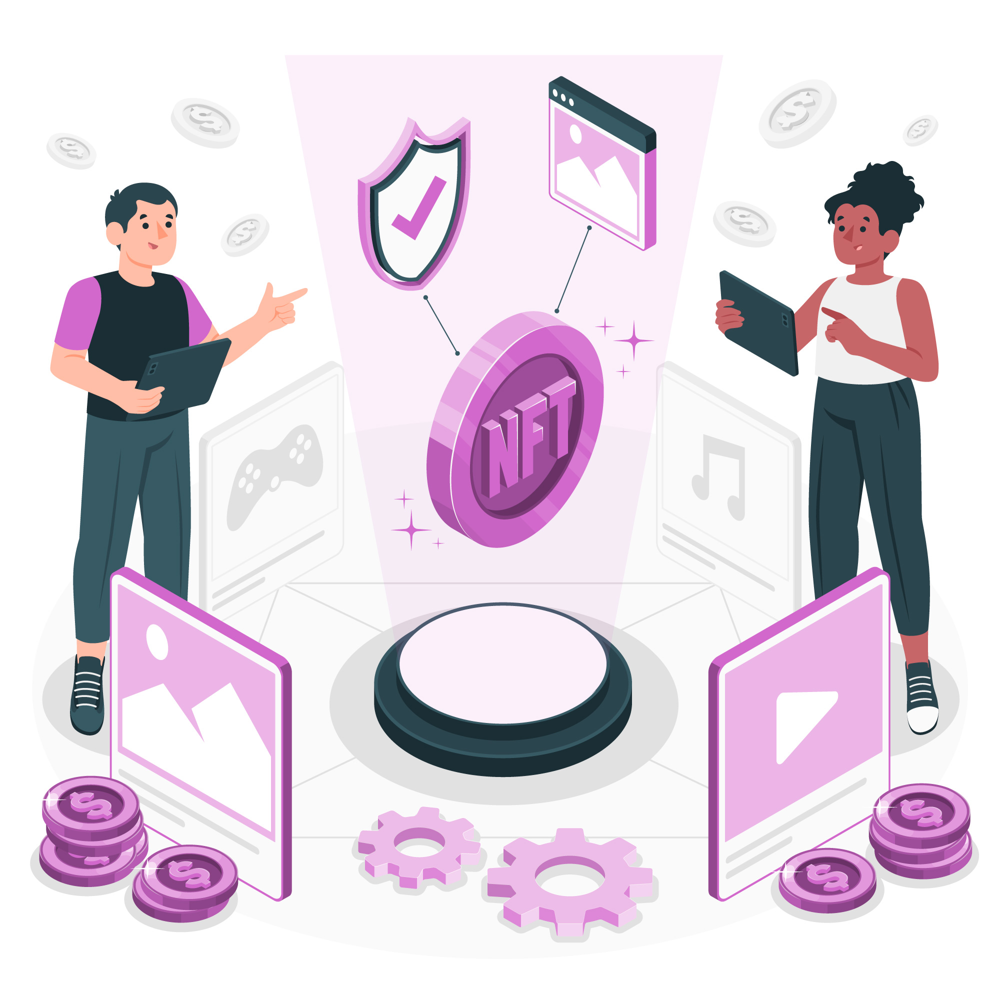

# 🟣 Resume EvocPlus

## Sobre o Projeto

Evocardano Plus é um token que será lançado na rede Bscscan , mas também será ligado a rede Cardanoscan. Onde após a atualização alonzo chegar a 100% e os bugs estiverem corrigidos, será permitido negociar os projetos Defi's na blockchain da cardano. Acredita-se na possibilidade de eliminação de bugs e hacks nos projetos Defi's. Com isso, surge **EVOCSWAP**, que é o desenvolvimento de uma DEX (exchange descentralizada) semelhante a Pancakeswap  para as duas redes. Onde permitirá que os usuários negociem ativos, de forma rápida, barata e segura.

<figure><figcaption></figcaption></figure>

Evocardano Plus será o token de governança , o token principal onde os investidores irão receber recompensas básicas nele próprio por criar um par de liquidez e manter seus tokens na plataforma fazendo stake. Ao invés de vender suas moedas você recebe mais delas como forma de juros por ajudar na sustentabilidade da liquidez da moeda. E também pode ganhar muito com a valorização da mesma.

## Visão do Projeto

Nossa visão inicial é construir o projeto na rede bscscan e ter estrutura suficiente para implementar nosso ecossistema na própria blockchain da cardano. Fazendo assim, a união da capitalização das duas redes visando também construir estrutura para lançar em outras redes. Assim podemos ter uma valorização extrema com a união de várias redes em Evocardano Plus. O ponto crucial e a importância de realmente sermos titulares deste projeto é que após juntarmos a capitalização de mercado de várias redes em nossa moeda, podemos ter uma valorização extrema. E será dessa forma que os investidores que sempre acreditaram no projeto, vão alcançar o objetivo que sempre esperou.

## Introdução no mercado NFT

<figure><figcaption></figcaption></figure>

Um dos maiores e crescentes mercados do mundo atualmente é o mercado de NFT's , com isso Evocardano Plus se tornará uma moeda para compra de  NFT's onde na rede Bscscan, a equipe irá introduzir um mercado de NFT's onde qualquer titular pode criar sua NFT, comprar com EVOC+ e ser proprietário melhorando ainda mais a sustentabilidade e criando um volume maior de marketcap da moeda e também poderá vender suas NFT's.
