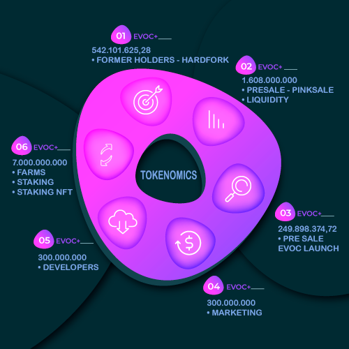

# 🐳 Tokenomics

## <mark style="color:purple;">DISTRIBUTION OF TOKENS</mark>

<figure><figcaption></figcaption></figure>

**WE HAVE AN INITIAL TOTAL OF 3,000,000,000 (THREE BILLION) UNITS.**

1. _(18,07%) = 542.101.625,28_

* [x] <mark style="background-color:purple;">**OLD HOLDERS/HARDFORK**</mark>

_2. (8,329...%) = 249.898.374,72_&#x20;

* [ ] <mark style="background-color:purple;">**1º PHASE PRE SALE EVOCLAUNCH**</mark>&#x20;

2\. _(53,6%) = 1.608.000.000_&#x20;

* [ ] <mark style="background-color:purple;">**2**</mark><mark style="background-color:purple;">º</mark> <mark style="background-color:purple;"></mark><mark style="background-color:purple;">**PHASE**</mark> <mark style="background-color:purple;">**PRE SALE/PINKSALE**</mark>
* [ ] <mark style="background-color:purple;">**LIQUIDITY**</mark>

4\. _(10%)  = 300.000.000_&#x20;

* [ ] <mark style="background-color:purple;">**MARKETING**</mark>

5\. _(10%)  = 300.000.000_&#x20;

* [ ] <mark style="background-color:purple;">**DEVELOPERS**</mark>

6\. (**CONTINUOUS SUPPLY**)  _= 7.000.000.000_&#x20;

* [ ] <mark style="background-color:purple;">**FARMS/STAKING**</mark>
* [ ] <mark style="background-color:purple;">**STAKING NFT**</mark>

* [x] **70% OF THE TOTAL SUPPLY IS MINT AUTOMATICALLY FOR STAKING AND FARMS, OUR TOTAL SUPPLY HAS A LIMIT OF 10,000,000,000 UNITS AFTER FILLING THIS AMOUNT IT WILL NO LONGER BE POSSIBLE TO PROVIDE TOKEN**.


**ATTENTION ANTI BOT AND ANTI SPILL MEASURES!!**

### 1º MONTH SALES TAX 15%

<mark style="color:green;background-color:green;">**FEE MAY BE REDUCED SOON**</mark>



## <mark style="color:purple;">TRANSACTION FEES</mark>&#x20;

#### 1. Of the 8% in purchases will be distributed:&#x20;

<mark style="background-color:green;">**3% Reflection**</mark> : _These fees are returned to token holders in the form of an ADA reward (Cardano). hold your EVOC+ tokens and receive ADA(Cardano) with every new distribution you have._

<mark style="background-color:green;">**3% Marketing**</mark> : _It is intended for the marketing portfolio where a good part of them will be used to publicize the project, contract with influencers and various advertisements with companies specialized in the subject._

&#x20;<mark style="background-color:green;">**1% Liquidez**</mark> : _It is allocated to the liquidity pool. Promoting price stability, maintaining a stable price, thus avoiding problems when making purchases and sales._

&#x20;<mark style="background-color:green;">**1% Buyback**</mark> : _It will be bought on the chart and burned, helping the currency appreciate, stabilizing the price and ensuring that value will never be sold._

**2. Of the 15% in sales will be distributed:**&#x20;

<mark style="background-color:red;">**4% Renda Passiva**</mark> : _These fees are returned to token holders in the form of an ADA reward (Cardano). hold your EVOC+ tokens and receive ADA(Cardano) with every new distribution you have._

<mark style="background-color:red;">**8% Marketing**</mark> : _It is intended for the marketing portfolio where a good part of them will be used to publicize the project, contract with influencers and various advertisements with companies specialized in the subject._

<mark style="background-color:red;">**1% Liquidez**</mark> : _It is allocated to the liquidity pool. Promoting price stability, maintaining a stable price, thus avoiding problems when making purchases and sales._

<mark style="background-color:red;">**2% Buyback**</mark> : _It will be bought on the chart and burned, helping the currency appreciate, stabilizing the price and ensuring that value will never be sold._

## <mark style="color:purple;">BLOCKED LIQUIDITY</mark>&#x20;

For the safety of all token holders who have given a vote of confidence and for those who want to be part of the project's success by reaping benefits in the future, we have decided to lock liquidity so that they can have the full trust of the EVOC+ development team. Liquidity is <mark style="color:green;background-color:green;">**locked for 2 years**</mark> via PinkSale, which is one of the best in the field for liquidity locks.

## <mark style="color:purple;">CONTINUOUS SUPPLY</mark>

Mintable tokens are tokens created without any activity related to the underlying consensus. These tokens are primarily minted on smart contract platforms such as Ethereum, which is the largest and most popular platform for mining new tokens. At a granular level, smart contracts have the function of minting new tokens according to the predetermined supply for farms and rewards. Once the function is triggered, new tokens are created, which are then distributed in the market. Our initial total supply is 3,000,000,000 billion coins and the total supply to be minted is 7,000,000,000 billion coins. After reaching this limit, it will not be possible to mint any more tokens.
