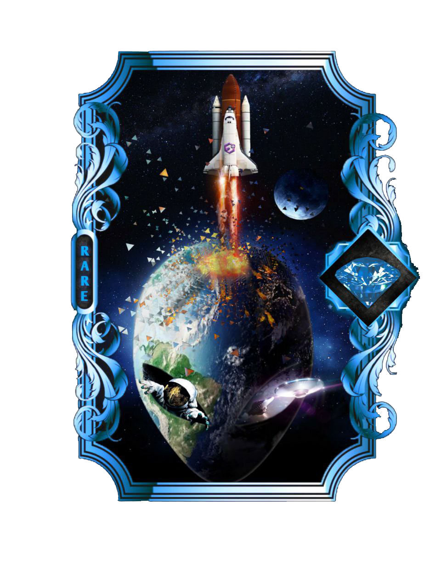
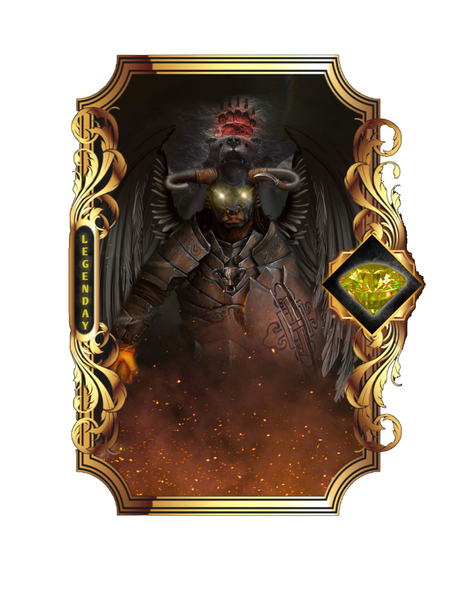

# 🪙 Stake NFT

## VISÃO DO STAKE

O Stake oferece aos investidores de criptomoedas uma forma de colocar seus ativos digitais para trabalhar e obter renda passiva sem precisar vendê-los.

É como se você colocasse dinheiro em uma poupança, mas de alto rendimento. Isso porque quando você deposita um montante em uma conta poupança, o banco pega esse dinheiro e normalmente o empresta para outras pessoas. Em troca, você recebe juros obtidos com os empréstimos – embora um percentual muito, muito baixo.

Da mesma forma, quando você faz staking de seus ativos digitais, você “bloqueia” as moedas para participar da execução da blockchain contribuir para a sua segurança.

Em troca disso, você ganha recompensas calculadas em rendimentos percentuais. Esses retornos costumam ser muito maiores do que qualquer rentabilidade oferecida pelos bancos.

Staking virou uma forma muito comum de lucrar com [criptomoedas](https://www.infomoney.com.br/guias/criptomoedas/) sem negociá-las propriamente. Em abril de 2022, o valor total das criptomoedas em stake ultrapassou o limite de US$ 280 bilhões, de acordo com o provedor de dados Staking Rewards.

## NFT PLUS

Idealizada exclusivamente pelo projeto serão NFT's lançadas diretamente pelo projeto artes valiosas com raridades especiais e com utilidade para você aumentar a porcentagem do seu stake dentro da plataforma e receber EVOC+ como recompensa. Irá existir três tipos de  raridades são elas , **Rara** , **Ruby** e **Lendária** cada coleção que for lançada você pode se tornar proprietário único de qualquer NFT elas vão ter um valor inicial para você comprar e também porcentagens de APR% especificas aumentando os ganhos dos seus rendimentos.

**Exemplo:**

<figure><figcaption></figcaption></figure>

 

<figure><figcaption></figcaption></figure>

 

<figure><figcaption></figcaption></figure>


Cada NFT Plus tem um preço inicial para o investidor comprar  e também existe uma porcentagem de recompensas pela utilidade delas, todas as artes lançadas pelo projeto são colecionáveis e você pode utilizar quantas você quiser em seu staking para aumentar os seus rendimentos. Quanto maior for o valor alocado em NFT's menor será a APR% mais a vantagem é que nem sempre serão lançadas as NFT Plus , o projeto poderá levar meses para lançar uma coleção , o que fortalece a escassez pelas artes e o que da força a elas no mercado de NFTs.

