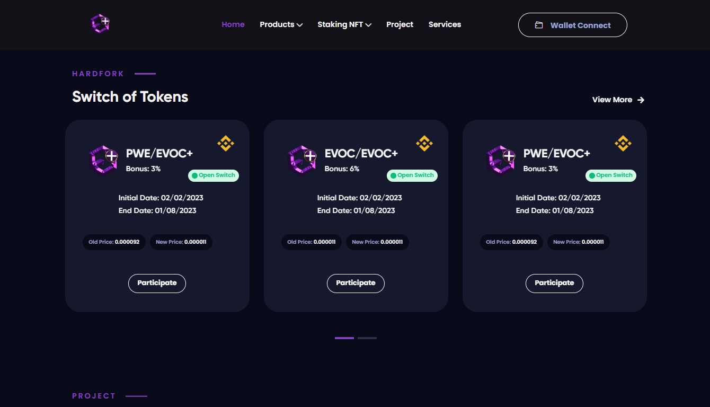

# 🔀 HardFork

Função idealizada para atualizações de contratos inteligentes , a plataforma possui um sistema automatizado onde é responsável por fazer a troca de moedas dos antigos contratos , para novas moedas de um novo contrato ou seja qualquer problema ou erro encontrado em um contrato a plataforma possui suporte suficiente na ajuda da atualização de qualquer projeto fazendo a ligação de um contrato antigo para um novo. Qualquer desenvolvedor pode utilizar criando e pagando uma taxa básica de 3 BNBs para utilizar o serviço na própria plataforma.

O Sistema possui uma inteligência artificial (AI) capaz de você próprio criar um hardfork a criação se resume em , preço antigo , novo preço , data de inicio , data final e um bônus caso você queira beneficiar sua comunidade você pode fazer uma edição na aba (dono criador)  quando quiser apenas conectando sua carteira.

<figure><figcaption>
<a href="https://www.evoclaunch.com/">https://www.evoclaunch.com/</a>
</figcaption></figure>
