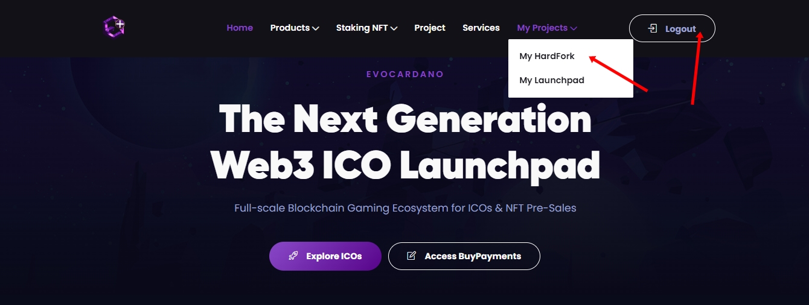
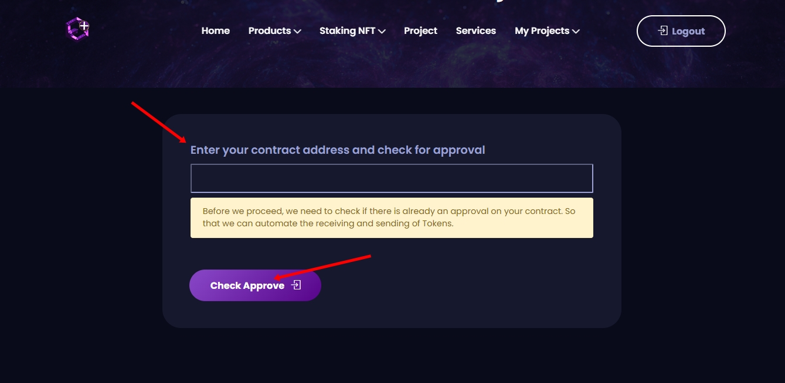
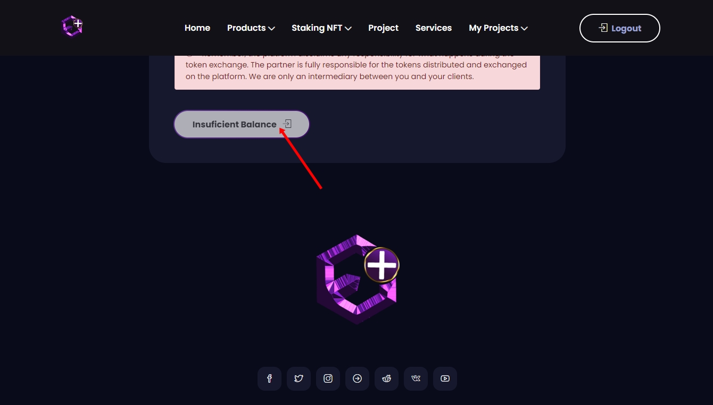

# 🔀 HardFork

Função idealizada exclusivamente pelo projeto para atualizações de contratos inteligentes , a plataforma possui um sistema automatizado onde é responsável por fazer a troca de moedas dos antigos contratos , para novas moedas de um novo contrato ou seja qualquer problema ou erro encontrado em um contrato a plataforma possui suporte suficiente na ajuda da atualização de qualquer projeto fazendo a ligação de um contrato antigo para um novo. Qualquer desenvolvedor pode utilizar criando e pagando uma taxa básica de 2 BNBs para utilizar o serviço na própria plataforma.

O Sistema possui uma inteligência artificial (AI) capaz de você próprio criar um hardfork a criação se resume em , preço antigo , novo preço , data de inicio , data final e um bônus caso você queira beneficiar sua comunidade você pode fazer uma edição na aba (dono criador)  quando quiser apenas conectando sua carteira.

## CRIANDO UM HARDFORK&#x20;

* Faça a conexão da sua carteira owner em ( Wallet Connect )
* Clique na opção a qual você deseja criar o hardfork , você só irá ver as opções para criação se sua carteira estiver conectada.

<figure><figcaption>
<a href="https://www.evoclaunch.com/">https://www.evoclaunch.com/</a>
</figcaption></figure>

* Você verá no canto direito a opção ( Create Now Hardfork ) click e siga para o próximo passo.&#x20;
* Se você já possui um hardfork irá aparecer abaixo para você apenas editar.

<figure><figcaption>
<a href="https://www.evoclaunch.com/">https://www.evoclaunch.com/</a>
</figcaption></figure>

* Coloque o contrato do token novo para aprovar e automatizar o recebimento dos antigos tokens.
* Click em ( Check Approve )
* Faça a aprovação da sua carteira , irá voltar para mesma tela após a aprovação , cole o contrato novamente e click em ( Check Approve ) mais uma vez.

<figure><figcaption>
<a href="https://www.evoclaunch.com/">https://www.evoclaunch.com/</a>
</figcaption></figure>

* Você será redirecionado a uma nova tela para o cadastramento do seu hardfork , a taxa de custo é 2 BNBs.
* Preencha o formulário de acordo com as informações , traduza a página caso esteja difícil de identificar as informações.
* Após a finalização do cadastramento , finalize a transação e aprove sua wallet.

<figure><figcaption></figcaption></figure>

 

<figure><figcaption></figcaption></figure>

* Ao finalizar o seu cadastramento , volte na tela inicial e você verá o seu hardfork registrado e preparado para ser divulgado para a sua comunidade.

### CONTATO PARA SUPORTE

* Grupo  para suporte : [https://t.me/+iBiJv0Mc1ko2ZGYx](https://t.me/+iBiJv0Mc1ko2ZGYx)
* Entre e marque algum dos admins citados : @oliverevoc @Alenaldo e aguarde ser atendido.
