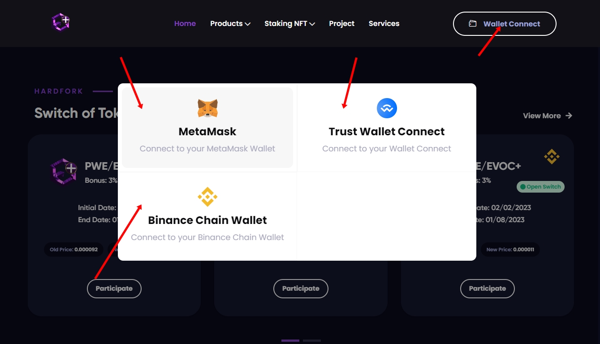
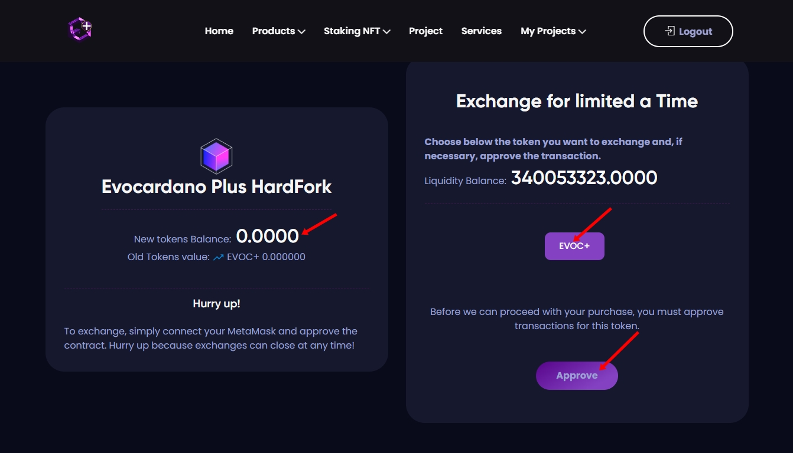

# Participation Tutorial

## PARTICIPANDO DO HARDFORK PC.

* Click em (Wallet Connect) para conectar a carteira de sua preferência onde está os tokens antigos que deseja troca-los.

<figure><figcaption></figcaption></figure>

* Logout significa que você está conectado com a sua carteira!
* Abaixo em Switch of Tokens está localizado todos os hardfork de projetos que estão ativos.
* Observe o nome ao lado da logo do projeto , identifique quais as moedas antigas que você deseja trocar e click em (Participate)&#x20;

<figure><figcaption></figcaption></figure>

* Após você  prosseguir , você será redirecionado a uma nova aba onde será necessário você aprovar sua wallet!
* Click em EVOC+ vai aparecer o botão ( Approve ) click nesse botão e faça a aprovação da sua carteira.

<figure><figcaption></figcaption></figure>

* Após você ter aprovado a sua carteira , a página irá atualizar e você deve clikar em EVOC+ novamente.
* Vai aparecer um campo para você digitar a quantidade de tokens antigas que você tem em sua wallet.
* &#x20;No canto esquerdo você consegue identificar a quantidade de tokens antigas que você tem para trocar pelas novas.&#x20;
* Digite a quantidade de tokens antigos que você tem ,  e depois click em   ( Switch Currency ) para finalizar a transação você ganha um bônus a mais de tokens se caso o seu projeto definir uma porcentagem. Como pode ver na imagem abaixo:

<figure><figcaption></figcaption></figure>

1. Confira se os tokens chegaram em sua carteira.
2. Em caso de dúvidas entre em contato com o suporte.

### CONTATO PARA SUPORTE

* Grupo  para suporte : [https://t.me/+iBiJv0Mc1ko2ZGYx](https://t.me/+iBiJv0Mc1ko2ZGYx)
* Entre e marque algum dos admins responsaveis pelo projeto
