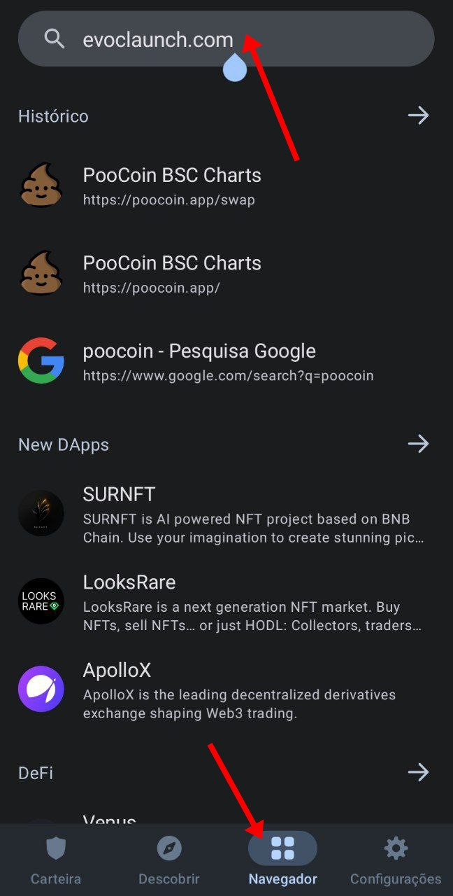
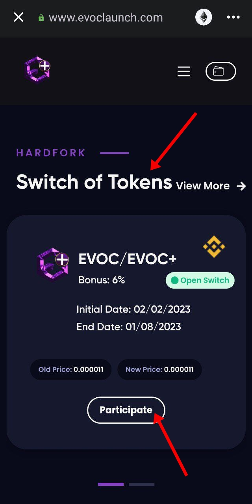
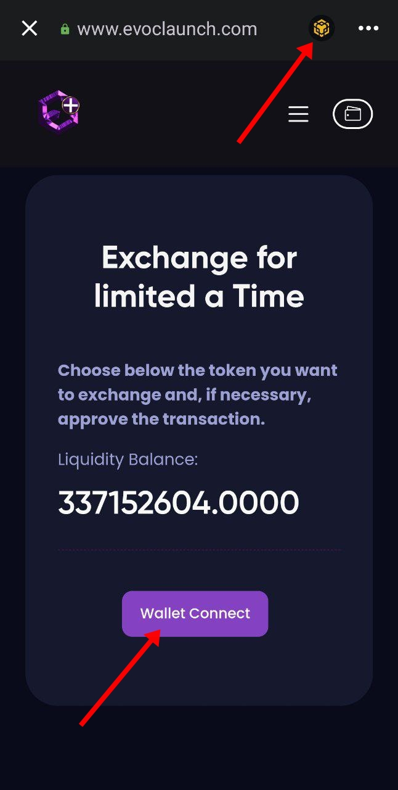
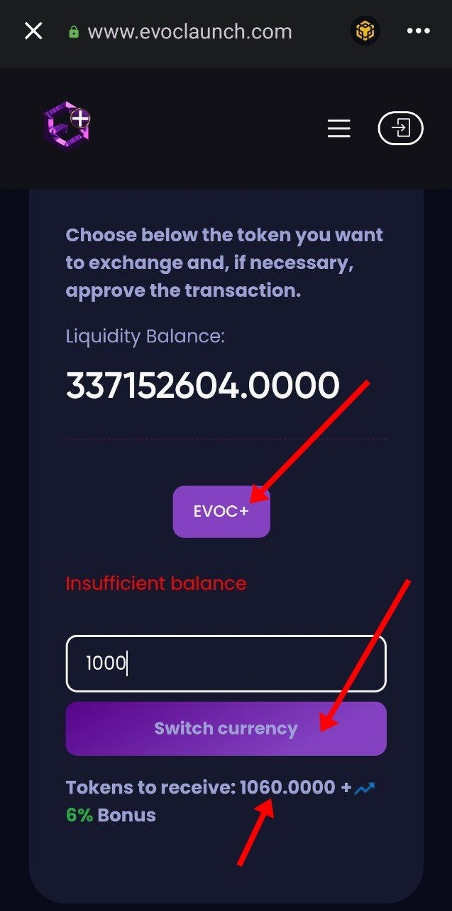
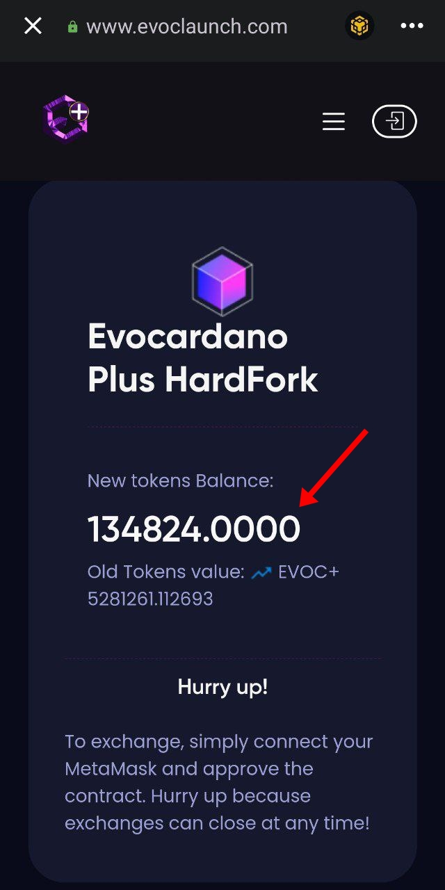

# Tutorial  Android

## PARTICIPATING IN HARDFORK ANDROID.

## <mark style="color:purple;">1º STEP</mark>

* Open your wallet and go to your wallet's browser option!
* Enter the [evoclaunch.com](https://www.evoclaunch.com/) platform address and access it through your wallet's browser!

<figure><figcaption></figcaption></figure>

## <mark style="color:purple;">2º STEP</mark>

* Scroll down and find the hardfork option ( Switch of Tokens ).
* Review which project you want to participate in the hardfork.
* Click on (Participate) to open your currency exchange settings.

<figure><figcaption></figcaption></figure>

## <mark style="color:purple;">3º STEP</mark>

* See which network your wallet is connected to in the top right corner, you need to be on the network (Binance Smart Chain) to connect the wallet correctly.
* After being on the correct network, click on (Wallet Connect).

<figure><figcaption></figcaption></figure>

## <mark style="color:purple;">4º STEP</mark>

* After your wallet is connected , click on ( EVOC+ )
* Approve your wallet for the network to recognize.
* You will pay a small utility gas fee for approval.

<figure><figcaption></figcaption></figure>

## <mark style="color:purple;">5º STEP</mark>

* Now click on the button ( EVOC+ ) again, it will open a field for you to type the old amounts of your coins.
* If you do not have the desired coins in this wallet , you will see ( Insufficient Balance )
* Put the amount of currency you want to exchange.
* If the project sets a bonus for you, you will notice that there is a notification with the percentage of extra tokens you will receive.
* Click ( Change Currency ) and approve a transaction.

<figure><figcaption></figcaption></figure>

## <mark style="color:purple;">6º STEP</mark>

* That's it, your old tokens were exchanged for new tokens.
* Scroll up and the platform will report the exchanged tokens.
* Do not forget to register the new currency contract in the wallet to verify that it is there.

<figure><figcaption></figcaption></figure>

## CONTACT FOR SUPPORT

* Support Group: [https://t.me/+iBiJv0Mc1ko2ZGYx](https://t.me/+iBiJv0Mc1ko2ZGYx)
* Enter and tag any of the admins responsible for the project.
