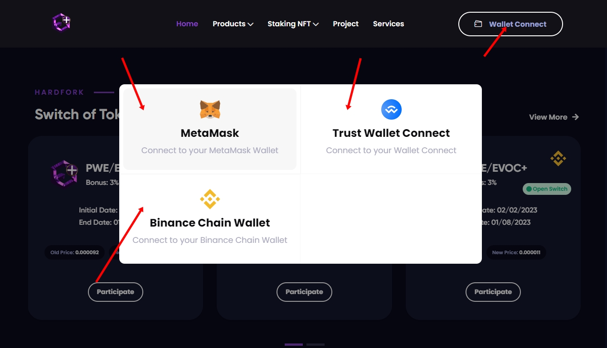
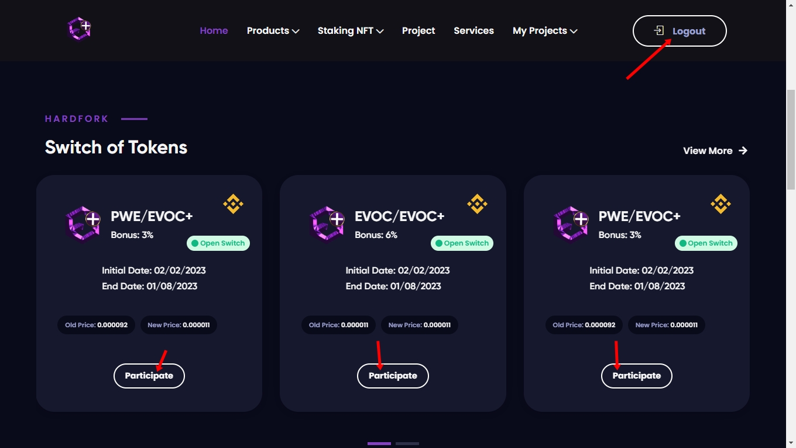
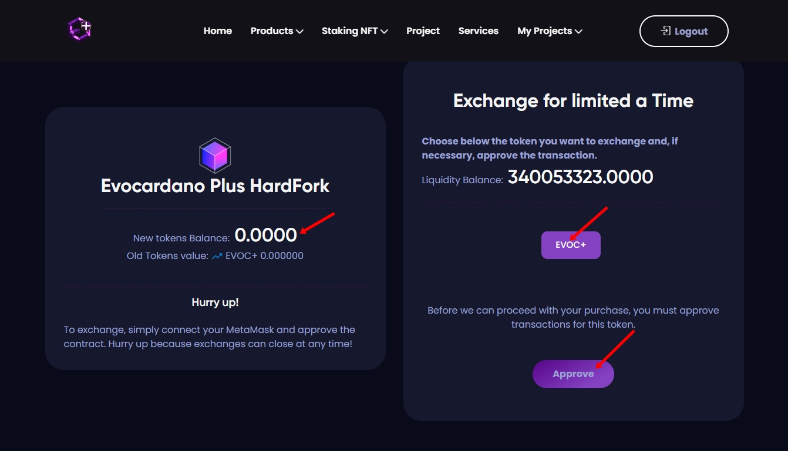
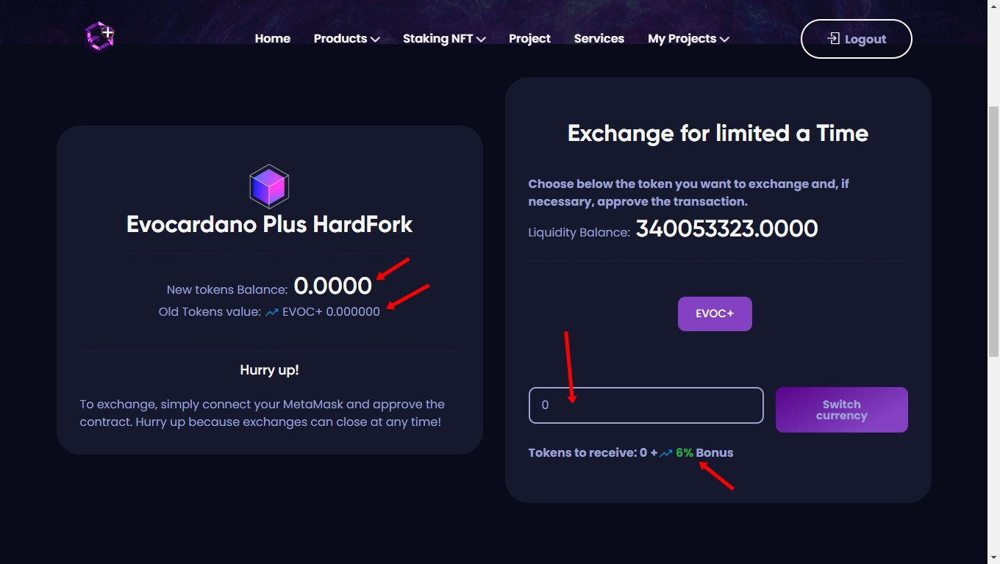

# Tutorial Desktop

## PARTICIPANDO DO HARDFORK PC.

## <mark style="color:purple;">1º PASSO</mark>

* Click em (Wallet Connect) para conectar a carteira de sua preferência onde está os tokens antigos que deseja troca-los.

<figure><figcaption></figcaption></figure>

## <mark style="color:purple;">2º PASSO</mark>

* ( Logout ) significa que você está conectado com a sua carteira!
* Abaixo em Switch of Tokens está localizado todos os hardfork de projetos que estão ativos.
* Observe o nome ao lado da logo do projeto , identifique quais as moedas antigas que você deseja trocar e click em ( Participate )&#x20;

<figure><figcaption></figcaption></figure>

## <mark style="color:purple;">3º PASSO</mark>

* Após você  prosseguir , você será redirecionado a uma nova aba onde será necessário você aprovar sua wallet!
* Click no botão ( EVOC+ ) vai aparecer um novo botão ( Approve ) click nesse botão e faça a aprovação da sua carteira.
* Você irá pagar uma pequena taxa de gás da rede.

<figure><figcaption></figcaption></figure>

## <mark style="color:purple;">4º PASSO</mark>

* Após você ter aprovado a sua carteira , a página irá atualizar e você deve clikar em ( EVOC+ ) novamente.
* Vai aparecer um campo para você digitar a quantidade de tokens antigas que você tem em sua wallet.
* &#x20;No canto esquerdo você consegue identificar a quantidade de tokens antigas que você tem para trocar pelas novas.&#x20;
* Digite a quantidade de tokens antigos que você tem ,  e depois click em   ( Switch Currency ) para finalizar a transação você ganha um bônus a mais de tokens se caso o seu projeto definir uma porcentagem. Como pode ver na imagem abaixo:

<figure><figcaption></figcaption></figure>

## <mark style="color:purple;">5º PASSO</mark>

* Pronto , seus tokens antigos foram trocados por novos tokens.
* Não esqueça de colar o novo contrato da moeda na carteira para conferir se está lá.

### CONTATO PARA SUPORTE

* Grupo  para suporte : [https://t.me/+iBiJv0Mc1ko2ZGYx](https://t.me/+iBiJv0Mc1ko2ZGYx)
* Entre e marque algum dos admins responsaveis pelo projeto
