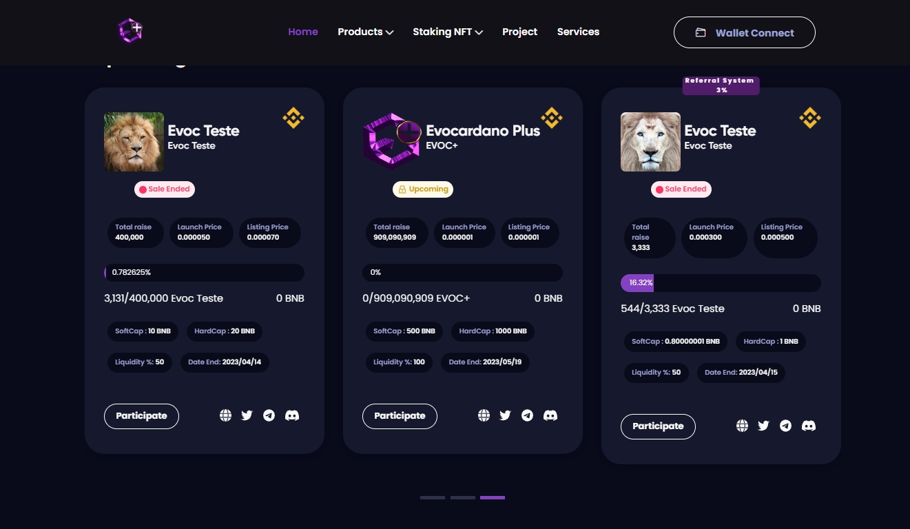

# 🚀 Launchpad AI

EvocLaunch é uma  plataforma de lançamento de novos projetos de criptomoedas em um ambiente seguro e controlado. Qualquer pessoa poderá desenvolver e utilizar a plataforma para criar o seu próprio projeto.

Ao participar de um lançamento no Launchpad, os investidores têm acesso antecipado à nova criptomoeda e a oportunidade de comprar tokens com desconto. Além disso, a equipe de desenvolvimento do projeto pode se beneficiar da ampla exposição e credibilidade que a plataforma de lançamento oferece, o que pode ajudar a aumentar a adoção e o sucesso da criptomoeda no mercado.

<figure><figcaption>
<a href="https://www.evoclaunch.com/">https://www.evoclaunch.com/</a>
</figcaption></figure>


## VANTAGEM


A Taxa que você paga para fazer uma pré venda  do seu projeto em nossa launchpad é 1 BNB + 5% da arrecadação total em BNB da sua pré venda. EvocLaunch não retém porcentagem  dos seus tokens , diferentemente de outras launchpad que retém 2% a 4% e acaba vendendo no lançamento prejudicando o seu projeto. Temos sistema de pagamento PIX integrado na plataforma em parceria com a [buypayments.blog](https://www.buypayments.blog/) e estamos bem encaminhados desenvolvendo parcerias com empresas de KYC e Auditorias.

Estamos estruturando nossa launchpad e nosso objetivo é chegar a ser uma das Launchpad mais utilizada no mercado com sistema de AI e  cross-chain com várias redes , Tendo em vista também o nosso token principal EVOC+ todos os mêses 40% do lucro da plataforma vai para liquidez  EVOC+ e será queimado garantindo assim ainda mais valorização para nossa moeda.


## SEGURANÇA


EvocLaunch possui um dos melhores sistemas para a segurança  do seu investimento a plataforma só libera a liquidez para o desenvolvedor após a finalização do claim , ou seja só após as suas moedas estiverem em sua carteira é que eles conseguem ter acesso ao dinheiro aplicado pelos investidores. Também o desenvolvedor é livre para fazer o cancelamento da pré venda e a plataforma devolve todo o dinheiro aplicado pelos investidores liberando o claim para reembolso.

Embora existem muitos desenvolvedores mal intencionados , e você sempre será o total responsável pelo seu investimento , a segurança da plataforma  é garantida  , não garantimos segurança após a liquidez já ter ido para a mão dos desenvolvedores do projeto no qual você está investindo. Por esse motivo sempre tente filtrar todos os projetos que você está investindo , estude o projeto e as pessoas que estão por trás antes de você aplicar o seu dinheiro.&#x20;

