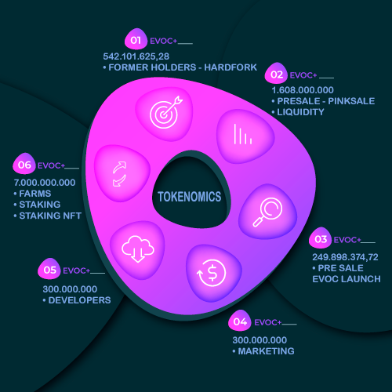

# 🐳 Tokenomics

## <mark style="color:purple;">DISTRIBUTION OF TOKENS</mark>

<figure><figcaption></figcaption></figure>

**TOTAL OF 970.000.000.000.000 ( NINE HUNDRED AND SEVENTY TRILLION ) UNITS.**

<mark style="background-color:green;">**6,9%**</mark>% =  Cex Listing ( 51,41 trillion )  \
\
<mark style="background-color:green;">**4.8%**</mark> =  Staking NFT ( 45,59 trillion) \
\
<mark style="background-color:green;">**4.5%**</mark> =  Marketing   ( 43.65 trillion) \
\
<mark style="background-color:green;">**4.4%**</mark> = Team    ( 42.68 trillion )

<mark style="background-color:green;">**56.1%**</mark>= Liquidity Pool (544,77 trillion) \
\
<mark style="background-color:green;">**5%**</mark>   = Burn (145,5 trillion ) \
\
<mark style="background-color:green;">**18,3%**</mark>   = Ecosystem ( 97 trillion )\

## <mark style="color:purple;">TRANSACTION FEES</mark>&#x20;

**BUY TAX: **<mark style="background-color:green;">**5%**</mark>

**SELL TAX: **<mark style="background-color:green;">**5%**</mark>\
\
1\. Of the 5% in purchases will be distributed:&#x20;

<mark style="background-color:green;">**1.5% Staking NFT Pool**</mark> : these fees will be used to increase the liquidity pool of NFT's and consequently increase the ROI for investors.

<mark style="background-color:green;">**0.5% Contest Pool**</mark> : We will be holding several contests for our investors, where we will distribute all the accumulated value to the top winners.

&#x20;<mark style="background-color:green;">**2% Marketing**</mark> : These funds will be used to help spread information with advertisements, influencers, AMA's in international tier 1 groups, banners on famous websites, posts in groups with whales, and more.

&#x20;<mark style="background-color:green;">**1% Liquidity**</mark> : used to ensure greater longevity of the project, increasing liquidity and keeping the chart more stable to generate greater convenience and security for investors

**2. Of the 5% in sales will be distributed:**&#x20;

<mark style="background-color:red;">**1.5% Staking NFT Pool**</mark> : these fees will be used to increase the liquidity pool of NFT's and consequently increase the ROI for investors.

<mark style="background-color:red;">**0.5% contest pool**</mark> : We will be holding several contests for our investors, where we will distribute all the accumulated value to the top winners.

<mark style="background-color:red;">**2% marketing**</mark> : These funds will be used to help spread information with advertisements, influencers, AMA's in international tier 1 groups, banners on famous websites, posts in groups with whales, and more.

<mark style="background-color:red;">**1% liquidity**</mark> : used to ensure greater longevity of the project, increasing liquidity and keeping the chart more stable to generate greater convenience and security for investors

## <mark style="color:purple;">BLOCKED LIQUIDITY</mark>&#x20;

For the safety of all token holders who have given a vote of confidence and for those who want to be part of the project's success by reaping benefits in the future, we have decided to lock liquidity so that they can have the full trust of the **Pinscher Coin** development team. Liquidity is <mark style="color:green;background-color:green;">**locked for 2 years**</mark> via PinkSale, which is one of the best in the field for liquidity locks.

## <mark style="color:purple;">CONTINUOUS SUPPLY</mark>

Mintable tokens are tokens created without any activity related to the underlying consensus. These tokens are primarily minted on smart contract platforms such as Ethereum, which is the largest and most popular platform for mining new tokens. At a granular level, smart contracts have the function of minting new tokens according to the predetermined supply for farms and rewards. Once the function is triggered, new tokens are created, which are then distributed in the market. Our initial total supply is 3,000,000,000 billion coins and the total supply to be minted is 7,000,000,000 billion coins. After reaching this limit, it will not be possible to mint any more tokens.
