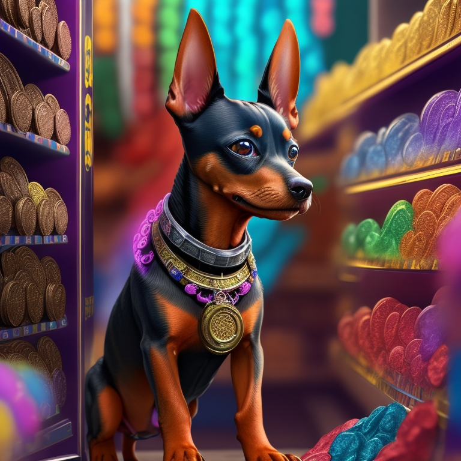

# 🔂 PinscherSwap


**PinscherSwap** helps you explore your cryptocurrency exchange, with a simple and fast experience in one place.


## ↔️ TRADE

Instantly exchange your cryptocurrencies: no registration and account required.

<figure><figcaption></figcaption></figure>

## THE BEST CHOICE&#x20;

The Token is part of the Binance Smart Chain and will have its own DEX (decentralized exchange), being a fast platform with better usability in the market. With the goal of eliminating many serious issues such as slow transactions and high fees, this will make a big difference and bring a better experience for our investors.

## DECENTRALIZATION&#x20;

Trade directly from your wallet app. Unlike centralized exchanges. **PinscherSwap** does not hold your funds when you trade: you have 100% ownership of your own cryptocurrencies.
