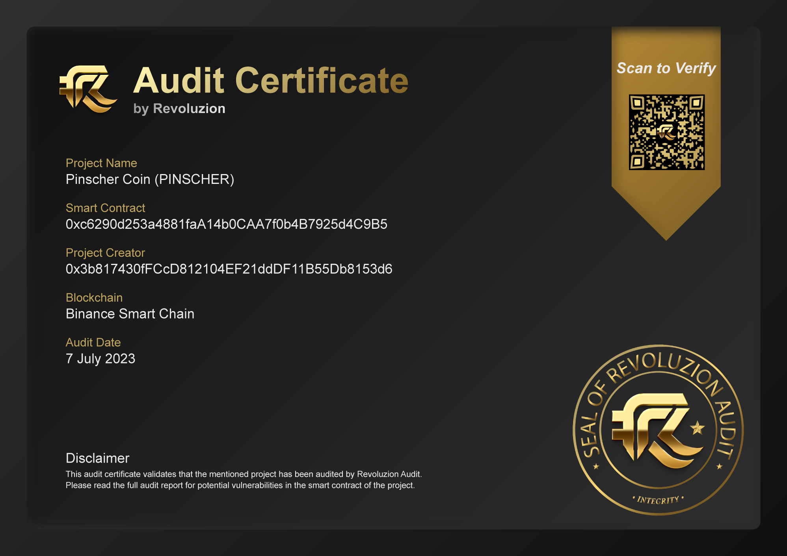

# 🛡 Audit and Security

<figure><figcaption></figcaption></figure>


[**https://revoluzion.app/audits/pinscher**](https://revoluzion.app/audits/pinscher)

Audit successfully completed! We achieved an 84% success rate on our contract, which is a fantastic result. Moreover, we are proud to state that no critical errors or security flaws were identified throughout the entire process.

This demonstrates our commitment to ensuring quality and security at every stage of the project. We thank everyone involved for contributing to this success.


### ✅ We take this opportunity to highlight that Pinscher Coin presents itself as a promising and robust project for investments. With an experienced team and a strategic vision, we are confident that the growth and potential for returns are highly attractive. 
