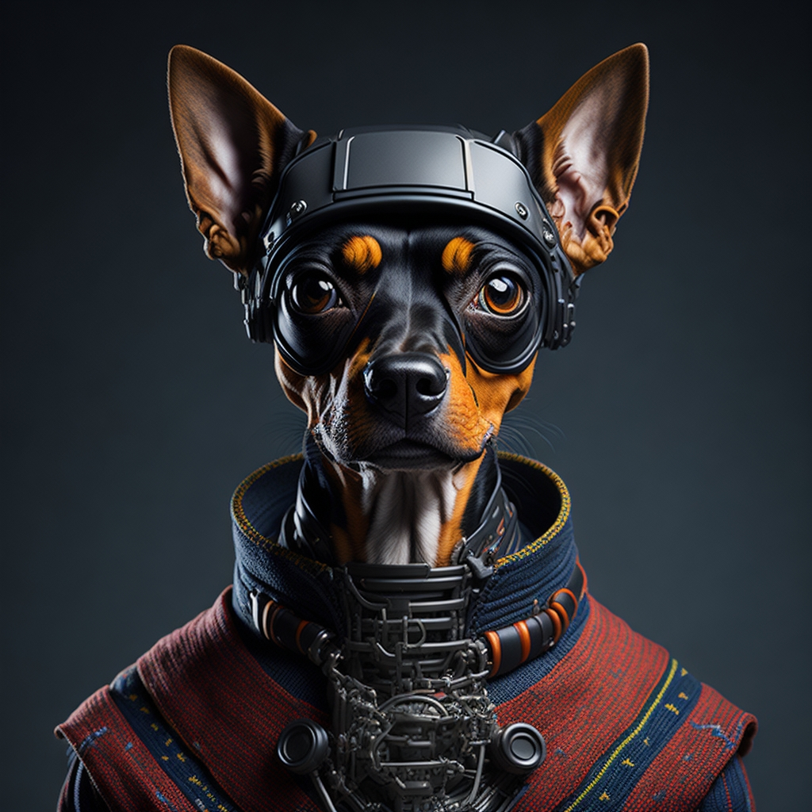
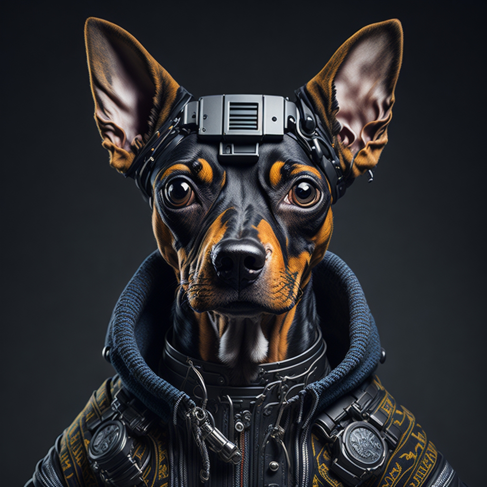

# 👨🚀 Staff Team

## WHERE DID PINSCHER COIN COME FROM?

Pinscher Coin was founded by CFO Vladimir Santos , who currently has experience in the cryptocurrency market and operates on the binance futures market the meme came from a well-known image on the internet. CEO Silvano president of the project is responsible for the financial operations and marketing of the project.

## WHERE IS THE PINSCHER TEAM FROM?

The team is located in Brazil and England, with all members working remotely. most of the team is of foreign origin and developed this memecoin to be one of the largest in the market.

## INTRODUCING OUR TEAM&#x20;


\
• CFO - Vladimir Santos / Chief Financial Officer

• CEO - Silvano  Silva / Chief Executive Officer

• DEV - Max Romano / IT Programmer

• CSM - A.S Jhoma / Customer Success Manager

• DESIGNER - Willian Aquino



<figure><figcaption>
 <mark style="color:orange;"><strong>CEO - Silvano  Silva / Chief Executive Officer</strong></mark>
</figcaption></figure>

<figure><figcaption>
<mark style="color:orange;"><strong>CFO - Vladimir Santos / Chief Financial Officer</strong></mark>
</figcaption></figure>

<figure><figcaption>
<mark style="color:orange;"><strong>DEV - Max Romano / IT Programmer</strong></mark>
</figcaption></figure>
