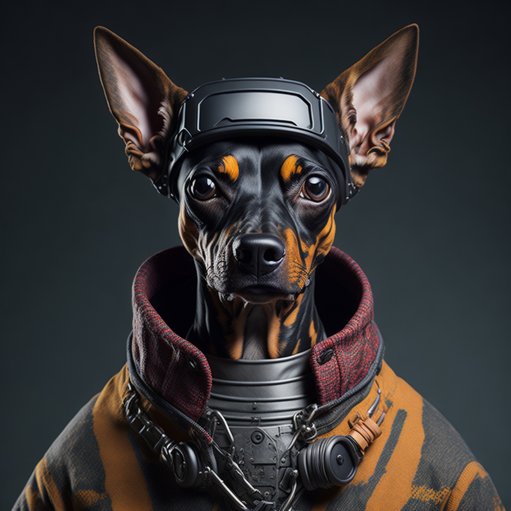

# 👷♂ Staff Team

## WHERE DID PINSCHER COIN COME FROM?

Pinscher Coin was founded by CFO Vladimir Santos, who currently holds extensive experience in the cryptocurrency market and operates in the Binance futures market. The meme originated from a well-known internet image, driven by CEO Silvano. He decided to create a specialized team for developing this grand idea, with COO Antônio Carlos being responsible for marketing and financial operations of the project.

## WHERE IS THE PINSCHER TEAM FROM?

The team is located in Brazil and England, with all members working remotely. most of the team is of foreign origin and developed this memecoin to be one of the largest in the market.

## INTRODUCING OUR TEAM&#x20;


\
• CFO - Vladimir Santos / Chief Financial Officer

• CEO - Silvano  Silva / Chief Executive Officer

• COO - Antônio Carlos / Chief Operating Officer

• CSM - Anthony Jhoma / Customer Success Manager

• DEV - Max Romano / IT Programmer

• DESIGNER - Willian Aquino



<figure><figcaption>
 <mark style="color:orange;"><strong>CEO - Silvano  Silva / Chief Executive Officer</strong></mark>
</figcaption></figure>

<figure><figcaption>
 <mark style="color:orange;"><strong>COO - Antônio Carlos / Chief Operating Officer</strong></mark>
</figcaption></figure>

<figure><figcaption>
<mark style="color:orange;"><strong>CFO - Vladimir Santos / Chief Financial Officer</strong></mark>
</figcaption></figure>

<figure><figcaption>
<mark style="color:orange;"><strong>DEV - Max Romano / IT Programmer</strong></mark>
</figcaption></figure>
