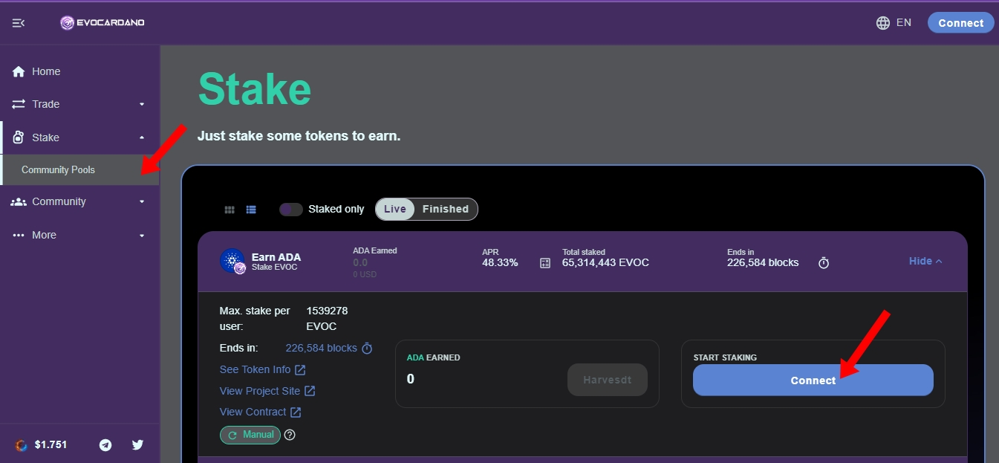
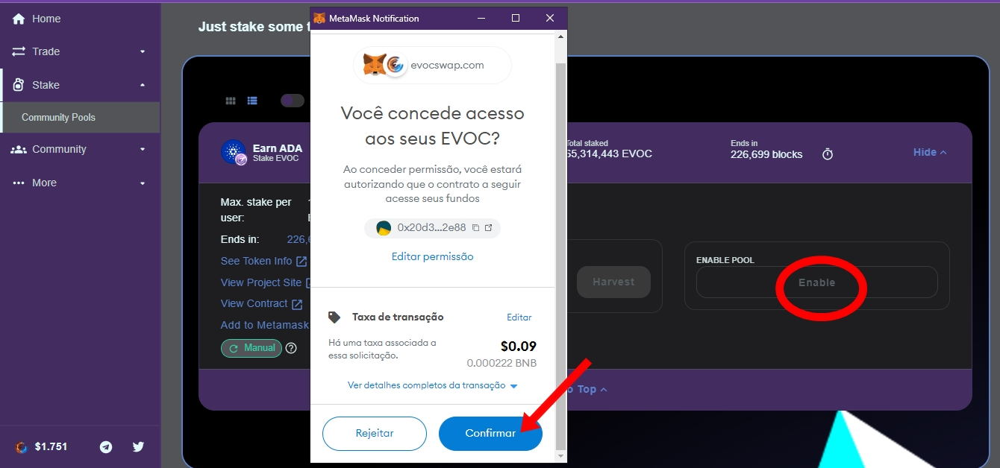
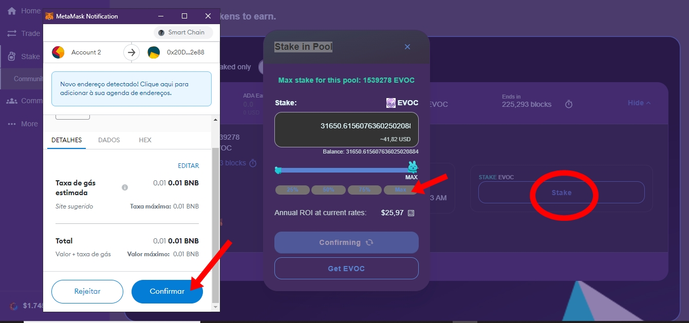

# ♻ STAKE POOLS

## STAKE POOLS

**Step 1:** To start betting on EvocSwap pools is very simple, look in the left menu for STAKE\<COMMUNITY POOLS, once you have done that, connect your wallet with dex.

**Passo 2  :** After connecting your wallet with dex, approve your wallet so that it has access to deposit your tokens,you will pay a small fee for your wallet network fee in this option of the pools you do not pay a fee for wallet transfers Evocardano and Power Evoc tokens have a certain priority and are 0 fee to deposit in this pool option.

* <mark style="color:green;">**POWER EVOC  = FREE RATE**</mark>
* <mark style="color:green;">**EVOCARDANO = FREE RATE**</mark>


#### OTHER COINS THAT DO NOT HAVE PARTNERSHIPS WITH OUR ECOSYSTEM HAVE A 10% FEE TO STAKE IN THE POOLS, EITHER BTC,ETH,ADA,ETC...


**Passo 3 :** After you confirm access to your wallet, you are ready to stake. Click on the stake button and choose which one of your tokens you want to stake, then just confirm, it will appear for you to confirm once again the network fee of your wallet.

**Passo 4 :** Tokens ready and successfully deposited now the tokens that were in your wallet suffering from market volatility, are yielding for you use the harvest button whenever you want to redeem your earnings wait always create your snowball on evocswap and become a whale in the future, think long term.

.jpg>)

