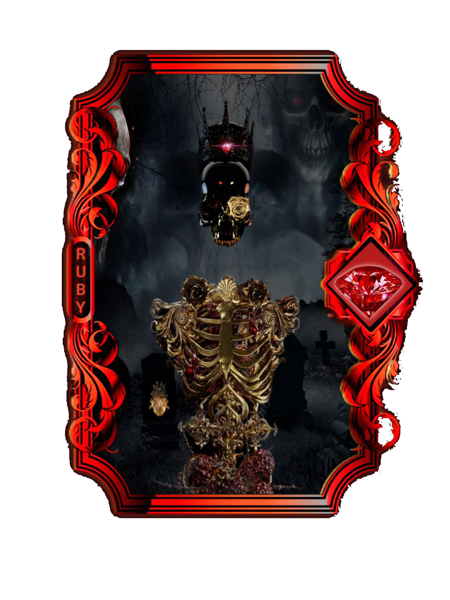

# ➡ NFT PLUS

## FUNCIONAMENTO

Idealizada exclusivamente pelo projeto Evocardano serão NFT's lançadas diretamente pelo projeto artes valiosas com raridades especiais e com utilidade para você aumentar a porcentagem do seu staking dentro da plataforma e receber EVOC+ como recompensa. Irá existir três tipos de  raridades são elas , **Rara** , **Ruby** e **Lendária** cada coleção que for lançada você pode se tornar proprietário único de qualquer NFT elas vão ter um valor inicial para você comprar e também porcentagens de APR% especificas na função do staking.

**Exemplo:**

&#x20;                   **( NFT RARA )                                        ( NFT RUBY )                                      ( NFT LENDÁRIA)**

<figure><figcaption>
Ex: 100% APR (200$)EVOC+
</figcaption></figure>

 

<figure><figcaption>
Ex : 200% APR (400$)EVOC+
</figcaption></figure>

 

<figure><figcaption>
Ex : 400% APR (800$)EVOC+
</figcaption></figure>


Cada NFT Plus tem um preço inicial para o investidor comprar  e também existe uma porcentagem de recompensas pela utilidade delas, todas as artes lançadas pelo projeto são colecionáveis e você pode utilizar quantas você quiser em seu staking para aumentar os seus rendimentos. Quanto maior for o valor alocado em NFT's menor será a APR% mais a vantagem é que nem sempre serão lançadas as NFT Plus , Evocardano poderá levar meses para lançar uma coleção , o que fortalece a escassez pelas artes e o que da força a elas no mercado de NFTs.


### MARKETPLACE COMPRAS E VENDAS

Teremos um marketplace , de alta performance e qualidade onde você poderá criar o seu perfil de artista e colocar suas artes a venda para outros investidores dar o devido valor que suas coleções de NFT merece , a cada compra um novo proprietário. Até suas artes ser uma das mais conhecidas no mundo. Nesse mercado também serão vendidas as NFT's Plus onde o proprietário poderá colocar a venda pelo valor que desejar.
