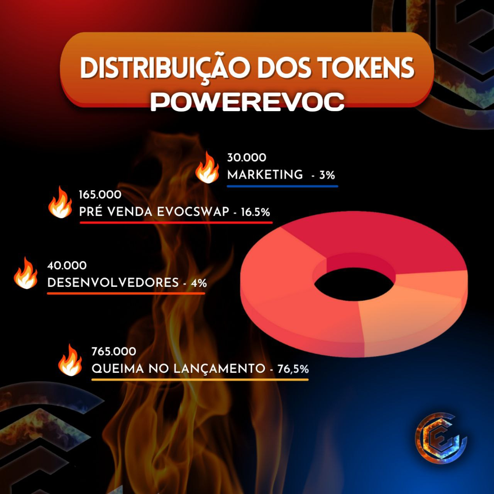

# 🎯 Tokenomics

## <mark style="color:blue;">Transaction Fees:</mark>

**1 .  Of the 6% on purchases will be distributed:**

* 3% Liquidity
* 2% Buy and burn $EVOC
* 1%  Marketing

**2 .  Of the 10% in sales will be distributed:**&#x20;

* 5% Liquidity
* 3% Buying and burn $EVOC
* 2% Marketing

## <mark style="color:blue;">**Total Supply:**</mark>

**We have a total of 1,000,000 (one million) of continuous units.**

**1 .**  30,000 - THIRTY THOUSAND.

* **MARKETING  - 3%**                                             &#x20;

**2 .** 165,000 - ONE HUNDRED AND SIXTY FIVE THOUSAND.

* **EVOCSWAP PRE-SALE - 16.5%**

**3.**  40,000 - FORTY THOUSAND.

* **DEVELOPERS - 4%**&#x20;

**4.**  764,824 - SEVEN HUNDRED AND SEVENTY-FOUR THOUSAND EIGHT HUNDRED AND TWENTY-FOUR.

* **BURN AT LAUNCH - 76,48%🔥**   &#x20;

## <mark style="color:blue;">Continuous Supply</mark>

Mintable tokens (mintables) are the type of tokens created without performing any activity related to the underlying consensus. These tokens are mostly mintable (created) on smart contract platforms, like Ethereum being the biggest and most popular for mining new tokens. At a granular level, smart contracts have the function of minting new tokens according to predetermined supply. As soon as the function is triggered, new tokens are created, which are distributed in the market.

## <mark style="color:blue;">Liquidity</mark>

Liquidity will not be locked. the continuous supply token model is inflationary, which means that new tokens are minted regularly for a purpose, such as a public service. The main focus in a continuous delivery model is to increase utility and underlying benefits. The continuous supply model is also used by Stablecoins that maintain a 1:1 with the US dollar, and the protocol ensures that each token does not exceed or decrease its price of $1.
