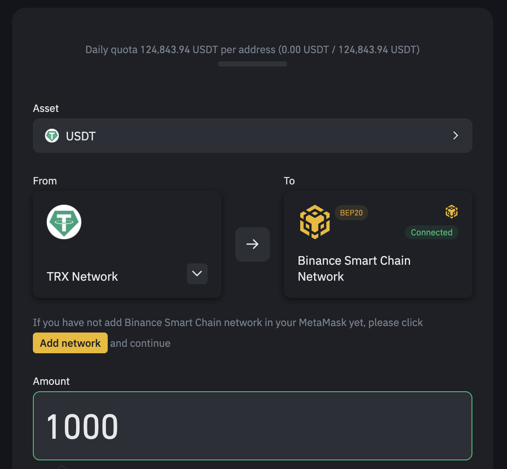
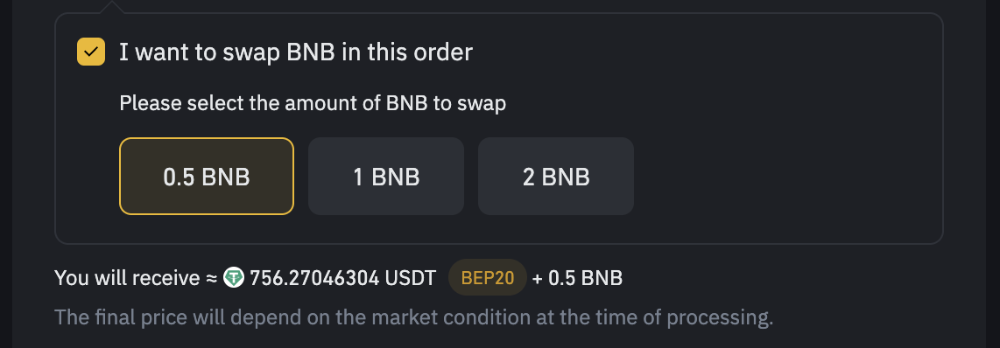
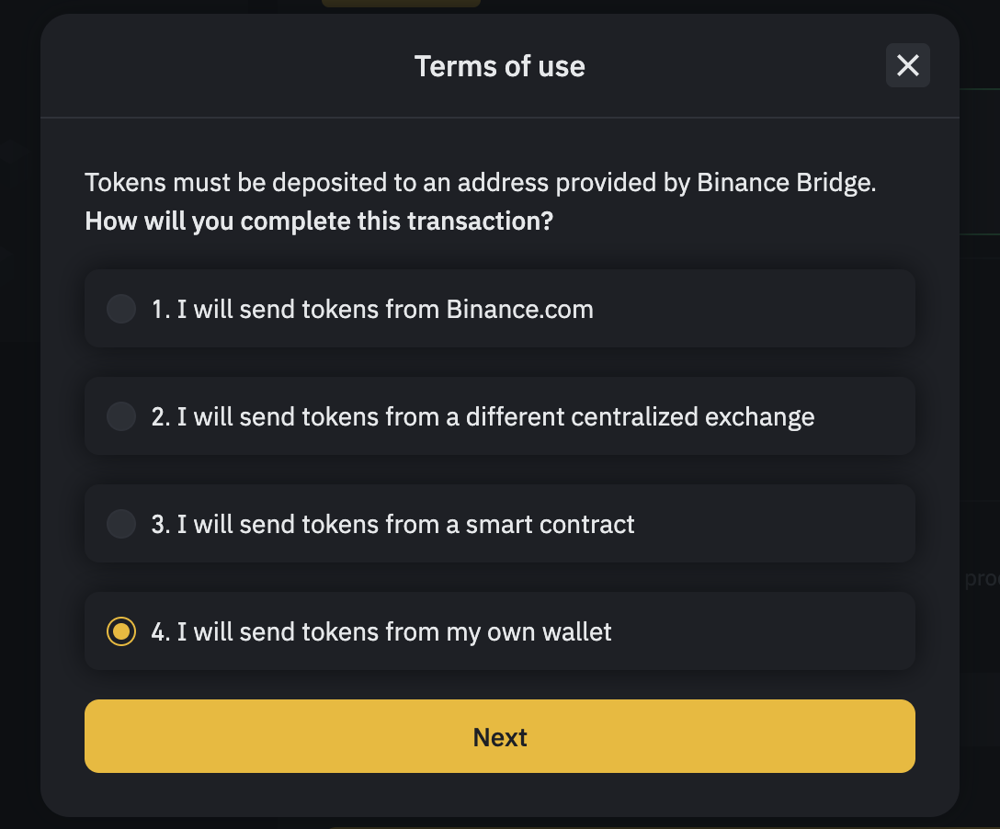
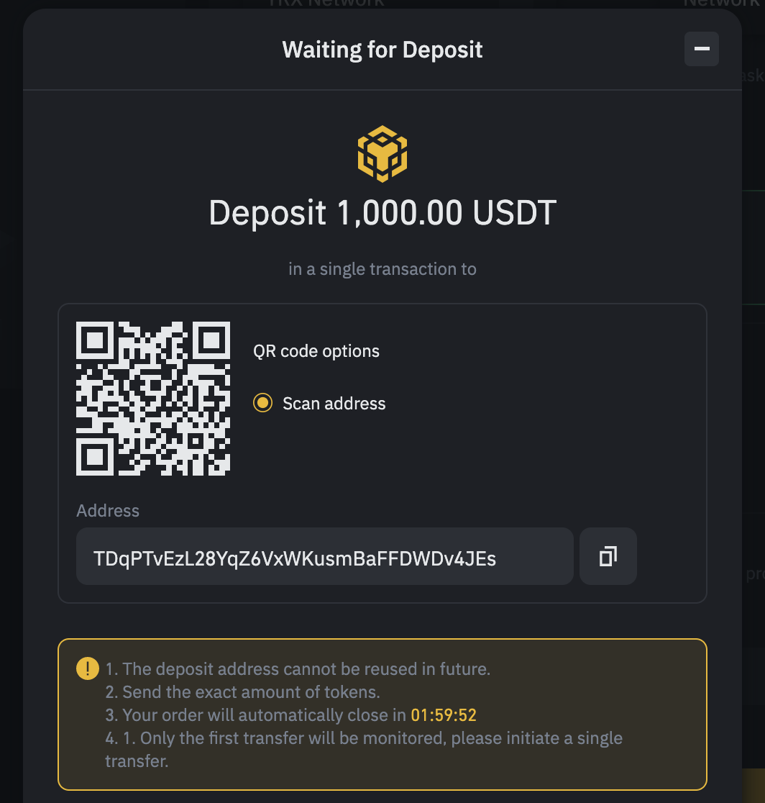

# 🔁 Trocas descentralizadas

EvocSwap é um aplicativo descentralizado. Isso significa que, diferentemente da Binance ou de outras plataformas centralizadas, você não precisa registrar uma conta para usá-la... você só precisa de uma carteira criptográfica.&#x20;

Então, como você pode obter criptografia na EvocSwap sem usar uma troca centralizada?

Neste tutorial, vamos guiá-lo pelo processo de usar "pontes de cadeia cruzada" para transferir seus ativos para sua carteira Binance Smart Chain e começar a usar a EvocSwap.

### Mova seus ativos de outras blockchains para a Binance Smart Chain

Você pode usar uma variedade de diferentes pontes de cadeia cruzada para transferir tokens da Ethereum ou de outras redes para a Binance Smart Chain.

Nos tutoriais a seguir, vamos demonstrar como mover o USDT de uma variedade de blockchains diferentes para a Binance Smart Chain, usando três pontes de cadeia cruzada diferentes.



A Binance Bridge pode ser a ponte mais fácil de usar para mover ativos para a Binance Smart Chain (BSC).

No exemplo a seguir, mostraremos como mover o USDT do blockchain TRON para o BSC usando o Binance Bridge.

O processo é quase o mesmo para mudar do Ethereum para o BSC.

Em

1. Prepare sua carteira TRON com USDT e um pouco de TRX para largura de banda (gás).
2. Como o Binance Bridge suporta apenas MetaMask e Binance Chain Wallet. Se você estiver usando outros aplicativos de carteira, recomendamos que você importe sua carteira para o MetaMask.
3. Navegue até https://www.binance.org/en/bridge
4. Conecte sua carteira MetaMask ou Binance Smart Chain.
5. Selecione TRX Network como "A partir de", Binance Smart Chain Network como "Para". Em seguida, digite a quantidade de USDT que deseja transferir.                                                                                                           Em  Em
6. Além disso, você pode pedir à Binance Bridge para trocar alguns BNB por você no processo de mover seu USDT de TRON para BSC. Isso é particularmente útil quando você é novo na Binance Smart Chain com uma carteira nova e precisa de algum BNB para gasolina.                                   Em  Em
7. Verifique se o campo "Destino" está mostrando o endereço correto da carteira Binance Smart Chain que você conectou.
8. Clique em “Avançar”. E escolha a quarta opção.                                                                    **AVISO: Você só pode enviar fundos de uma carteira blockchain (neste caso, TRON). Se seus fundos estiverem em alguma outra troca centralizada, mova-os primeiro para a carteira blockchain.**                         Em  Em
9. Verifique se tudo está correto, clique em “Avançar”.
10. Por fim, siga as instruções na tela, use sua carteira blockchain (neste caso, carteira TRON) e envie fundos para o endereço fornecido. Por favor certifique-se:

&#x20;        1 . O endereço está correto.

&#x20;        2 . Conclua em uma única transação.

&#x20;        3 . Conclua dentro do prazo. (mostrado abaixo como contagem regressiva)

Em  Em

11 . Depois de concluir a transação. Você deve receber seu fundo na carteira        Binance Smart Chain em alguns minutos. Depois disso, você pode começar a usar o PancakeSwap para trocar alguns tokens na Binance Smart Chain!

Além disso, você pode conferir este [**guia do usuário**](https://academy.binance.com/pt/articles/an-introduction-to-binance-bridge) e [**tutorial em vídeo**](https://fast.wistia.net/embed/iframe/fhip2z4nth) da Binance.

&#x20;  &#x20;


