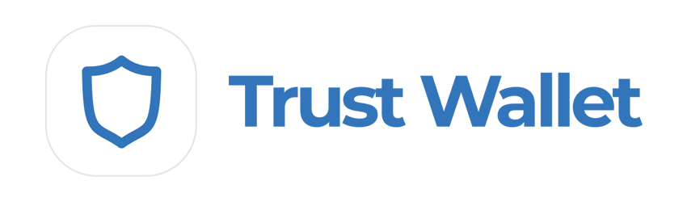

# ☑ Creating Your Wallet

To start using EvocSwap, the first thing you need to do is set up a wallet that supports Binance Smart Chain (BSC). Wallets are available on your desktop computers and smartphone devices. You will need to choose the wallet that best fits your needs.

* Open source for auditability
* Compatible with WEB3 ON BscScan
* A history of strong security and reliability
* A big quantity of guides with instructions and online resources
* Many tools and personalized settings
* Offers purchases of ETH with TRANSAK
* Supports a big number of languages
* It is also available a plugin of navigation for desktop devices


When setting up a wallet, make sure to:

✅ Download and install only the latest version from an official source.&#x20;

✅ Carefully follow the setup guide.

✅ Safely backup your recovery phrases.

❌ NEVER share your recovery phrases with anyone, under any circumstances.

❌ NEVER enter your recovery phrase on a website or app other than your wallet app.


## Wallet for smartphone/mobile or desktop

Wallets of Mobile devices and desktops have strengths. Consider which best fits your needs to help decide which type of wallet to use.

| In                                         | Mobile | Workspace |
| ------------------------------------------ | ------ | --------- |
| use anywhere                               | ✅      | ➖         |
| Easy to use                                | ✅      | ➖         |
| safer                                      | ➖      | ✅         |
| accessible friendly                        | ➖      | ✅         |
| Resistant to damage/loss/theft             | ➖      | ✅         |
| Resistant to power/connection interruption | ✅      | ➖         |

## Wallets for Smartphones / Cellphones

Smartphones/mobile wallets allow you to access your cryptocurrencies virtually practically anywhere. Wallets are available on Android and iOS devices.

## Which mobile wallet should I choose?

<table><thead><tr><th>In</th><th>Trust Wallet</th><th>Metamask</th><th data-hidden>Pocket Token</th><th data-hidden></th><th data-hidden></th></tr></thead><tbody><tr><td>Support for Binance Smart Chain</td><td>✅</td><td>⚠️</td><td>✅</td><td></td><td></td></tr><tr><td>Integrated dApp browser</td><td>
✅ Android

⚠️ iOS
</td><td>➖</td><td>✅</td><td></td><td></td></tr><tr><td>Hardware wallet compatible</td><td>➖</td><td>✅</td><td>➖</td><td></td><td></td></tr><tr><td>Open code (auditability))</td><td>✅</td><td>✅</td><td>✅</td><td></td><td></td></tr><tr><td>Interact with BscScan (for advanced users!)</td><td>➖</td><td>✅</td><td>➖</td><td></td><td></td></tr></tbody></table>

⚠️ requires some configuration.

You can find more detailed information about each wallet below, as well as download links and installation guides.




Trust Wallet is a popular wallet for smart devices. It supports DApps, NFT collectibles (with Opensea.io support) and wallet staking.

* Open source for auditing
* Backed by cryptocurrency exchange Binance
* Easily switch between multiple encryption networks
* Includes networks by default
* Includes portfolio participation options
* It has features such as NFT collection, BNB staking and DApp access within the wallet
* Language linked to phone settings
* DApps limitados

[**Download Trust Wallet**](https://trustwallet.com/) **(automatically detects the device)**&#x20;

[**Trust Wallet Setup Guide**](https://www.binance.com/en/blog/ecosystem/how-to-set-up-and-use-trust-wallet-for-binance-smart-chain-421499824684901157)



## **Desktop/Web Browser Wallets**

Desktop wallets are available on your home computer or laptop. Wallets on your computer can run as standalone apps or as web browser plugins for popular browsers like Chrome and Firefox.

## Which desktop wallet should I choose?

This comparison table provides an overview of the most popular wallets used with EvocSwap.

<table><thead><tr><th>Text</th><th>MetaMask</th><th>Carteira Binance</th><th data-hidden>Token Pocket</th></tr></thead><tbody><tr><td>Support for BNB Smart Chain</td><td>⚠️</td><td>✅</td><td>⚠️</td></tr><tr><td>Integrated DApp Browser</td><td>➖</td><td>➖</td><td>✅</td></tr><tr><td>Hardware wallet compatible</td><td>✅</td><td>✅</td><td>➖</td></tr><tr><td>Open source (audibility)</td><td>✅</td><td>✅</td><td>✅</td></tr><tr><td>Interacom BscScan (for advanced users)</td><td>✅</td><td>➖</td><td>➖</td></tr></tbody></table>

⚠️ Requires some configuration.

You can find more detailed information about each wallet below, as well as download links and installation guides :




MetaMask is a very popular browser-based wallet plugin that supports ERC20 (Ethereum network) by default and BEP2 and BEP20 (Binance Chain and BNB Smart Chain networks) with a little work.

* Open source for auditing
* Compatible with WEB3 in BscScan
* A strong track record of safety and reliability
* A wealth of how-to guides and online resources
* Lots of custom tools and settings
* Support a large number of languages
* Also available on mobile devices
* Longer setup time for other options
* Other additional options to use with BNB Smart Chain and EvocSwap
* Extra information and settings can confuse beginners

[**Download MetaMask**](https://metamask.io/download/) **(automatically detect browser)**&#x20;

[**MetaMask Setup Guide**](https://academy.binance.com/en/articles/connecting-metamask-to-binance-smart-chain)




Binance Wallet is a browser plugin wallet that natively supports Binance Chain (BEP2) and Binance Smart Chain (BEP20) networks. Binance Wallet was developed by cryptocurrency exchange Binance.

* Open source for auditability
* Backed by cryptocurrency exchange Binancedo pela exchange de criptomoedas Binance
* Can be directly linked to a Binance or Gmail account
* A simplified user experience
* Supports Binance Smart Chain by default, making EvocSwap easy to use&#x20;
* Supports a large number of languages
* Hardware wallet compatible
* Missing some custom settings from other wallets
* The lack of additional tools makes it impossible for some actions available in other portfolios
* Has fewer online features than more established wallets

&#x20;[**Download Binance Wallet**](https://www.bnbchain.world/en) **(detects device automatically)**   &#x20;

[**Binance Wallet Setup Guide**](https://docs.binance.org/smart-chain/wallet/binance.html)




**\*\* NEVER, under any circumstances, you should give someone your private key or recovery phrase ("start phrase"). This will give someone full access to your cryptocurrency!**

**The genuine website and team will never ask you to enter your private phrase.\*\***

